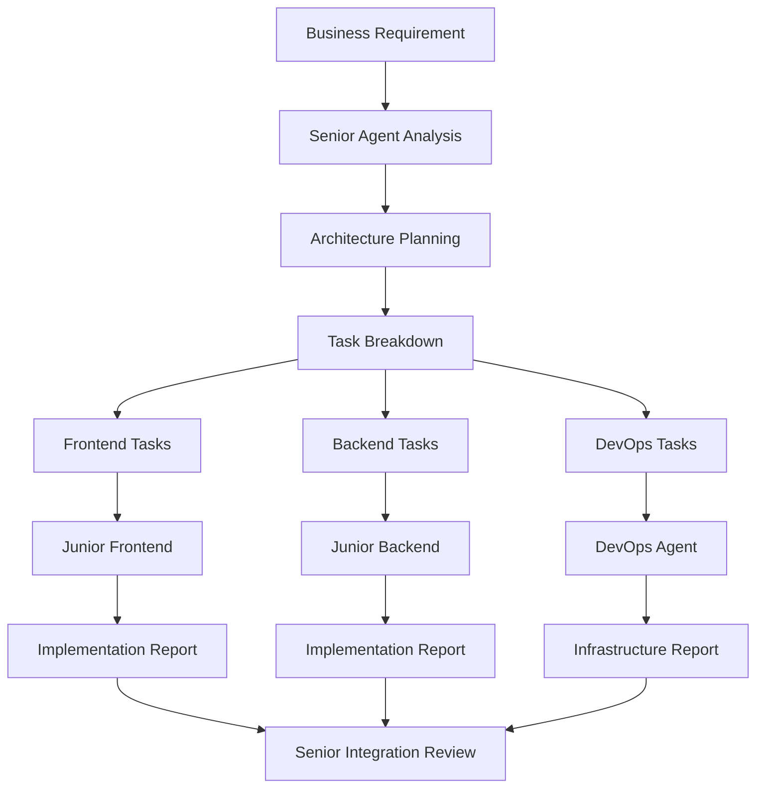

# Multi-Agent Workflows for Vibe Coding

> Coordination patterns for specialized AI agents working together on Svelte projects

## Agent Hierarchy Patterns

### Three-Tier Architecture
Based on AgentCoder patterns optimized for Svelte development.

```
Senior Full Stack Agent (80K tokens)
├── Junior Frontend Agent (25-40K tokens)
├── Junior Backend Agent (25-35K tokens)
└── DevOps Agent (30K tokens)
```

### Role Definitions

#### Senior Full Stack Agent
- **Responsibility**: Architecture decisions, task planning, integration oversight
- **Context**: Full project scope, business requirements, technical constraints
- **Output**: Detailed implementation plans, architectural guidance
- **Handoff**: Structured tasks with clear success criteria

#### Junior Frontend Agent  
- **Responsibility**: Component implementation, UI functionality
- **Context**: Frontend codebase, component patterns, design requirements
- **Input**: Implementation plans from senior agent
- **Output**: Working components, test coverage, implementation reports

#### Junior Backend Agent
- **Responsibility**: API endpoints, database operations, business logic
- **Context**: Backend codebase, database schema, API patterns
- **Input**: Implementation plans from senior agent
- **Output**: Working endpoints, tests, database migrations

#### DevOps Agent
- **Responsibility**: Deployment, infrastructure, build optimization
- **Context**: Infrastructure code, deployment scripts, monitoring
- **Input**: Infrastructure requirements from senior agent
- **Output**: Deployment configurations, monitoring setup

## Communication Protocols

### Task Delegation Flow


### Handoff Standards

#### Senior → Junior Communication
Use structured markdown templates for all task delegation:

```markdown
## Task: [ComponentName/FeatureName]
**Agent**: Junior Frontend/Backend
**Priority**: High/Medium/Low
**Estimated Effort**: [hours/complexity]
**Token Budget**: [25K/40K/etc]

### Context
Brief description of what this task achieves in the larger feature.

### Requirements
- Specific requirement 1
- Specific requirement 2
- Specific requirement 3

### Technical Specifications
- File locations
- Interface definitions
- Integration points

### Success Criteria
- [ ] Functional requirement met
- [ ] Tests pass
- [ ] Code follows patterns
- [ ] Documentation updated

### Resources
- Reference: docs/vibe-coding/patterns/[relevant-pattern].md
- Dependencies: [list components/APIs this relies on]
```

#### Junior → Senior Reporting
Standardized response format for consistent communication:

```markdown
## Implementation Report: [TaskName]
**Status**: ✅ COMPLETED / 🔄 IN PROGRESS / ❌ BLOCKED
**Duration**: [actual time taken]
**Token Usage**: [actual tokens used]

### Completed Tasks
- [x] Task 1 description
- [x] Task 2 description
- [x] Task 3 description

### Files Modified
- src/components/NewComponent.svelte (created)
- src/lib/types.ts (updated)
- src/tests/NewComponent.test.js (created)

### Implementation Details
Brief description of approach taken and key decisions made.

### Blockers/Issues
- Issue 1: Description and attempted solutions
- Issue 2: Description and impact

### Next Steps
- Follow-up task 1
- Integration requirement 2
- Testing consideration 3

### Questions for Senior Agent
- Question about integration approach
- Clarification needed on requirement
```

## Coordination Patterns

### Parallel Development
Multiple agents working simultaneously with clear boundaries.

```markdown
## Feature: User Profile Management
### Parallel Tasks (Week 1)

**Frontend Agent**: UserProfile component
- UserCard display component
- UserEdit form component  
- ProfilePicture upload component

**Backend Agent**: User API endpoints
- GET /api/users/:id
- PUT /api/users/:id
- POST /api/users/:id/avatar

**DevOps Agent**: Infrastructure updates
- CDN setup for avatar storage
- Database migration for new user fields
- API rate limiting configuration

### Integration Points
- Frontend uses backend API contracts
- Backend provides OpenAPI documentation
- DevOps ensures proper deployment of both
```

### Sequential Dependencies
Tasks that must complete in order.

```markdown
## Feature: Authentication System
### Sequential Workflow

1. **DevOps Agent** (Day 1-2)
   - Database setup for auth tables
   - Environment configuration
   - Security middleware setup

2. **Backend Agent** (Day 3-5)  
   - Auth API endpoints
   - JWT token management
   - User registration/login logic

3. **Frontend Agent** (Day 6-8)
   - Login/signup components
   - Auth store management
   - Protected route handling

### Handoff Checkpoints
- Day 2: DevOps confirms database ready
- Day 5: Backend provides API documentation
- Day 8: Frontend integration complete
```

## Context Management

### Shared Knowledge Base
All agents access common documentation to maintain consistency.

```
docs/vibe-coding/
├── patterns/               # Shared architectural patterns
├── templates/              # Reusable code templates
├── examples/               # Working implementations
└── project-specific/       # Current project context
    ├── api-contracts.md    # Backend/Frontend interface
    ├── component-library.md # UI component standards
    └── deployment-guide.md  # Infrastructure patterns
```

### Context Inheritance
Agents inherit relevant context from successful previous tasks.

```markdown
## Context Inheritance Example

**Previous Task**: UserCard component (successful)
**Current Task**: ProductCard component
**Inherited Context**: 
- Component structure patterns
- Styling approaches  
- Event handling patterns
- Testing strategies

**New Context**:
- Product-specific data structure
- Different API endpoints
- Product-specific business logic
```

### Memory Banks
Persistent knowledge storage across agent sessions.

```markdown
## Frontend Agent Memory Bank

### Successful Patterns
- UserCard implementation (ref: task-2024-001)
- SearchInput with debouncing (ref: task-2024-015)
- Modal component architecture (ref: task-2024-023)

### Lessons Learned
- Avoid complex prop drilling, use stores for deep data
- Always include loading states for async operations
- Use data-testid for reliable testing

### Component Dependencies
- Button: src/components/ui/Button.svelte
- Modal: src/components/ui/Modal.svelte  
- LoadingSpinner: src/components/ui/LoadingSpinner.svelte
```

## Error Handling and Recovery

### Escalation Patterns
Clear protocols for when junior agents encounter blockers.

```markdown
## Escalation Triggers

### Immediate Escalation (< 30 min)
- Build/compilation errors that prevent progress
- Missing dependencies or API contracts
- Security or authentication blockers

### Standard Escalation (< 2 hours)
- Complex integration requirements
- Unclear business logic requirements
- Performance optimization needs

### End-of-task Escalation
- Unable to meet success criteria
- Implementation approach needs architectural review
- Cross-agent coordination required
```

### Recovery Strategies
Patterns for getting agents back on track efficiently.

```markdown
## Recovery Patterns

### Context Reset
If agent seems confused or off-track:
1. Summarize current task objective
2. Restate key constraints
3. Provide simplified next step
4. Reference successful similar patterns

### Scope Reduction  
If task proves too complex:
1. Identify minimum viable implementation
2. Move advanced features to follow-up tasks
3. Focus on core functionality first
4. Plan incremental enhancement

### Pattern Fallback
If novel approach fails:
1. Reference proven similar implementations
2. Use established templates as starting point
3. Adapt working patterns to new requirements
4. Validate approach with senior agent
```

## Performance Optimization

### Token Efficiency
Minimize context overhead in multi-agent workflows.

```markdown
## Token Budget Optimization

### Context Sharing
- Use references to shared docs instead of repeating content
- Maintain agent-specific context summaries
- Update memory banks with successful patterns

### Communication Efficiency  
- Use structured templates for all handoffs
- Avoid repeating project context in every task
- Reference previous successful implementations

### Parallel Processing
- Design tasks to minimize cross-agent dependencies  
- Use clear interface contracts for integration
- Enable simultaneous development where possible
```

### Quality Gates
Checkpoints to ensure multi-agent coordination quality.

```markdown
## Quality Checkpoints

### Daily Standups (Async)
Each agent reports:
- Tasks completed yesterday
- Current task progress  
- Blockers or questions
- Integration dependencies

### Weekly Integration Reviews
Senior agent reviews:
- Cross-agent integration points
- Architectural consistency
- Performance implications
- Technical debt accumulation

### Feature Completion Reviews
Before feature release:
- End-to-end functionality testing
- Performance benchmark validation
- Security review completion
- Documentation update verification
```

## Advanced Patterns

### Event-Driven Coordination
Agents react to events from other agents' completions.

```markdown
## Event-Driven Workflow

### Event Types
- `component.created`: Frontend component ready for integration
- `api.deployed`: Backend endpoint available for frontend use
- `infrastructure.ready`: DevOps environment prepared
- `feature.integrated`: Cross-agent feature complete

### Event Handlers
Agents subscribe to relevant events and automatically trigger follow-up tasks.

Example:
- Backend agent completes user API → Triggers frontend agent to update user components
- Frontend agent creates new component → Triggers DevOps agent to update build optimization
```

### Self-Healing Workflows
Agents automatically recover from common coordination failures.

```markdown
## Self-Healing Patterns

### Dependency Resolution
If agent encounters missing dependency:
1. Check if dependency task is assigned to another agent
2. Request status update from responsible agent  
3. Implement temporary mock/fallback if needed
4. Queue integration task for when dependency ready

### Version Synchronization
If agents work with conflicting versions:
1. Detect version mismatches in integration
2. Escalate to senior agent for resolution
3. Implement compatibility layer if needed
4. Update all agents with synchronized versions
```

## Measurement and Optimization

### Workflow Metrics
Track multi-agent efficiency and identify optimization opportunities.

```markdown
## Key Metrics

### Coordination Efficiency
- Average handoff time between agents
- Number of clarification rounds per task
- Integration success rate on first attempt

### Resource Utilization
- Token usage per agent role
- Task completion time vs estimates
- Parallel vs sequential task ratios

### Quality Indicators
- Cross-agent integration defect rate
- Rework frequency due to miscommunication
- Customer satisfaction with feature delivery
```

### Continuous Improvement
Regular optimization of multi-agent patterns based on performance data.

```markdown
## Weekly Optimization Process

1. **Analyze Metrics**: Review coordination efficiency data
2. **Identify Bottlenecks**: Find most common handoff delays
3. **Update Patterns**: Refine communication templates
4. **Test Improvements**: Trial new coordination approaches
5. **Document Lessons**: Update workflow documentation
6. **Train Agents**: Update agent instructions with improvements
```